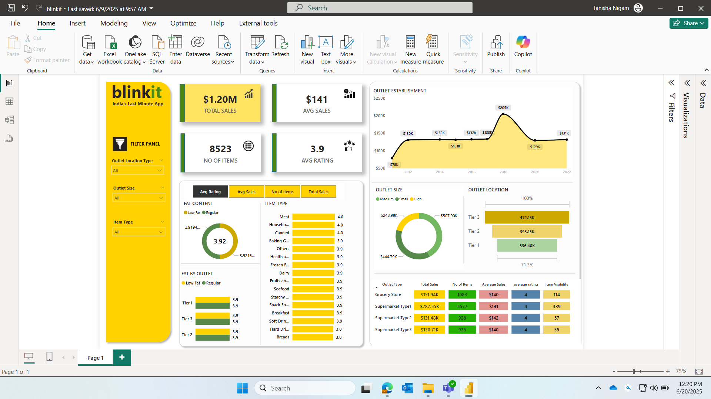

📊 Blinkit Sales Dashboard - Power BI Project

An interactive sales analytics dashboard for Blinkit, designed to visualize and explore key performance metrics like sales, outlet performance, item distribution, 
and customer rating insights. Built using Microsoft Power BI.

 🧰 Tech Stack

| Layer        | Tools / Technologies          |
|--------------|-------------------------------|
| Dashboard    | Microsoft Power BI            |
| Data Source  | Excel Workbook / SQL Server   |
| Language     | DAX, Power Query (M)          |
| Design       | Custom Visuals, Filters, Slicers |

📌 Key Highlights for blinkit1 screen shot

- 📈 Total Sales: $1.20M  
- 🛒 No. of Items: 8,523  
- ⭐ Average Rating: 3.9  
- 💰 Average Sales per Outlet: $141  

📊 Dashboard Features

 1. Filter Panel
- Outlet Location Type
- Outlet Size
- Item Type

 2. Visualized KPIs
- Total Sales, Number of Items, Average Sales, and Rating
- Item type-based ratings and sales
- Fat content distribution with Low Fat vs Regular options
- Outlet-wise performance for:
  - Sales
  - Number of Items
  - Average Sales & Ratings
  - Item Visibility

 3. Charts and Visuals
- Line Chart of Outlet Establishment Trends (2012–2022)
- Donut Charts for Outlet Sizes
- Bar Charts for Outlet Locations and Item Fat Type

🎯 Insights Delivered

- High-performing outlet type: Supermarket Type1
- Best-selling outlet tier: Tier 3
- Top-rated item types: Meat, Household, and Canned goods
- Visibility vs. performance comparison across outlet types

🛠️ Tools Used

📂 Project Files

- `Blinkit_Dashboard.pbix` – Power BI file
- `sales_data.xlsx` – Sample data file (if applicable)
- `README.md` – Project documentation

 📸 Preview

📫 Contact

For queries, reach out at tanishanigam3@gmail.com

---

## 🔖 Tags

`PowerBI` `Sales Dashboard` `Retail Analytics` `Blinkit` `DAX` `Business Intelligence`
